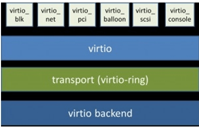
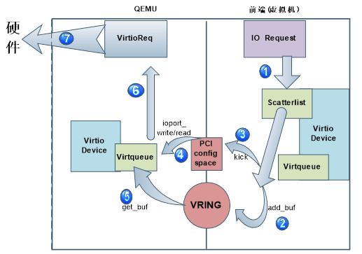
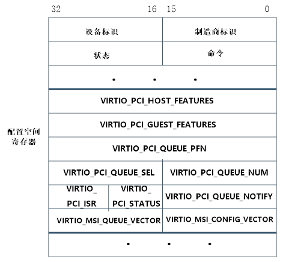
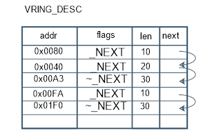
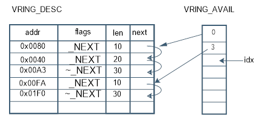
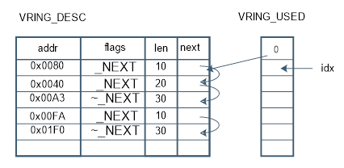
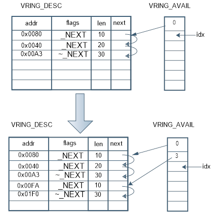
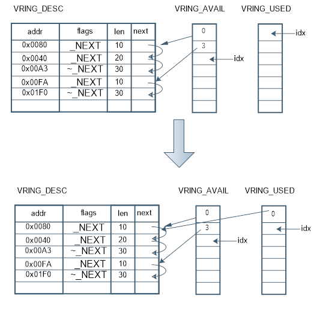

# virtio简介（一）—— 框架分析

## 1. 概述

在传统的设备模拟中，虚拟机内部设备驱动完全不知道自己处在虚拟化环境中，所以I/O操作会完整的走 虚拟机内核栈->QEMU->宿主机内核栈，
产生很多VM Exit和VM Entry，导致性能很差。Virtio方案旨在提高I/O性能。在该方案中虚拟机能够感知到自己处于虚拟化环境中，
并且会加载相应的virtio总线驱动和virtio设备驱动，执行自己定义的 协议进行数据传输，减少VM Exit和VM Entry操作。

## 2. 架构

VirtIO由 Rusty Russell 开发，对准虚拟化 hypervisor 中的一组通用模拟设备IO的抽象。
Virtio是一种前后端架构，包括前端驱动（Guest内部）、后端设备（QEMU设备）、传输协议（vring）。

前端驱动：虚拟机内部的 virtio模拟设备对应的驱动。作用为接收用户态的请求，然后按照传输协议对请求进行封装，再写I/O操作，发送通知到QEMU后端设备。
后端设备：在QEMU中创建，用来接收前端驱动发送的I/O请求，然后按照传输协议进行解析，再对物理设备进行操作，之后通过中断机制通知前端设备。
传输协议：使用virtio队列（virtio queue，virtqueue）完成。设备有若干个队列，每个队列处理不同的数据传输（如virtio-balloon包含ivq、dvq、svq三个）。

virtqueue通过 vring 实现。vring是虚拟机和QEMU之间共享的一段环形缓冲区，QEMU和前端设备都可以从vring中读取数据和放入数据。



## 3. 原理

### 3.1 整体流程

从代码上看，virtio的代码主要分两个部分：QEMU和内核驱动程序。Virtio设备的模拟就是通过QEMU完成的，QEMU代码在虚拟机启动之前，创建虚拟设备。
虚拟机启动后检测到设备，调用内核的virtio设备驱动程序来加载这个virtio设备。

对于KVM虚拟机，都是通过QEMU这个用户空间程序创建的，每个KVM虚拟机都是一个QEMU进程，虚拟机的virtio设备是QEMU进程模拟的，虚拟机的内存也是从QEMU进程的地址空间内分配的。
VRING是由虚拟机virtio设备驱动创建的用于数据传输的共享内存，QEMU进程通过这块共享内存获取前端设备递交的IO请求。

如下图所示，虚拟机IO请求的整个流程：


```text
1. 虚拟机产生的IO请求会被前端的virtio设备接收，并存放在virtio设备散列表scatterlist里；
2. Virtio设备的virtqueue提供add_buf将散列表中的数据映射至前后端数据共享区域Vring中；
3. Virtqueue通过kick函数来通知后端qemu进程。Kick通过写pci配置空间的寄存器产生kvm_exit；
4. Qemu端注册ioport_write/read函数监听PCI配置空间的改变，获取前端的通知消息；
5. Qemu端维护的virtqueue队列从数据共享区vring中获取数据
6. Qemu将数据封装成virtioreq;
7. Qemu进程将请求发送至硬件层。
```

前后端主要通过PCI配置空间的寄存器完成前后端的通信，而IO请求的数据地址则存在vring中，并通过共享vring这个区域来实现IO请求数据的共享。
从上图中可以看到，Virtio设备的驱动分为前端与后端：前端是虚拟机的设备驱动程序，后端是host上的QEMU用户态程序。
为了实现虚拟机中的IO请求从前端设备驱动传递到后端QEMU进程中，Virtio框架提供了两个核心机制：前后端消息通知机制和数据共享机制。

消息通知机制，前端驱动设备产生IO请求后，可以通知后端QEMU进程去获取这些IO请求，递交给硬件。
数据共享机制，前端驱动设备在虚拟机内申请一块内存区域，将这个内存区域共享给后端QEMU进程，前端的IO请求数据就放入这块共享内存区域，
QEMU接收到通知消息后，直接从共享内存取数据。由于KVM虚拟机就是一个QEMU进程，虚拟机的内存都是QEMU申请和分配的，属于QEMU进程的线性地址
的一部分，因此虚拟机只需将这块内存共享区域的地址传递给QEMU进程，QEMU就能直接从共享区域存取数据。

### 3.2 PCI配置空间

由整体流程图可知，guest和host交互传送信息的两个重要结构分别的PCI config和vring，本节重点分析实现消息通知机制的PCI配置空间。

#### 3.2.1 虚拟机是如何获取PCI配置空间的？

首先，我们为虚拟机创建的virtio设备都是PCI设备，它们挂在PCI总线上，遵循通用PCI设备的发现、挂载等机制。
当虚拟机启动发现virtio PCI设备时，只有配置空间可以被访问，配置空间内保存着该设备工作所需的信息，
如厂家、功能、资源要求等，通过对这个空间信息的读取，完成对PCI设备的配置。同时配置空间上有一块存储器空间，里面包含了一些寄存器和IO空间。

前后端的通知消息就是写在这些存储空间的寄存器，virtio会为它的PCI设备注册一个PCI BAR来访问这块寄存器空间。
配置空间如下图所示：



虚拟机系统在启动过程中在PCI总线上发现virtio-pci设备，就会调用virtio-pci的 probe 函数。
该函数会将PCI配置空间上的寄存器映射到内存空间，并将这个地址赋值给virtio_pci_device的ioaddr变量。之后要对PCI配置空间上的寄存器操作时，只需要ioaddr+偏移量。
`vp_dev->ioaddr = pci_omap(pci_dev, 0, 0);` pci_iomap函数完成PCI BAR的映射，第一个参数是pci设备的指针，第二个参数指定我们要映射的是0号BAR，
第三个参数确定要映射的BAR空间多大，当第三个参数为0时，就将整个BAR空间都映射到内存空间上。VirtioPCI设备的0号BAR指向的就是配置空间的寄存器空间，
也就是配置空间上用于消息通知的寄存器。

通过pci_iomap之后，我们就可以像操作普通内存一样（调用ioread和iowrite）来读写pci硬件设备上的寄存器。

### 3.2.2 虚拟机是如何操作这个配置空间的？

```text
1. kick: 当前端设备的驱动程序需要通知后端QEMU程序执行某些操作的时候，就会调用kcik函数，来触发读写PCI配置空间寄存器的动作。
2. 读写PCI寄存器: ioread/iowrite实现了对配置空间寄存器的读写，例如：
iowrite16(info->queue_index, vp_dev->ioaddr + VIRTIO_PCI _QUEUE_NOTIFY);
vp_dev->ioaddr + VIRTIO_PCI_QUEUE_NOTIFY 表示写notify这个寄存器，位置下
num =ioread16(vp_dev->ioaddr + VIRTIO_PCI QUEUE_NUM);
ioread读取QEMU端在配置空间寄存器上写下的值。在读写PCI设备配置空间的操作中，我们可以看到都是通过iodaar+偏移,来指向某个寄存
器，ioaddr这个变量是我们在Virtio-pci设备初始化的时候对它赋值，并指向配置空间寄存器的首地址位置。

```

### 3.2.3 qemu如何感知虚拟机的操作的？

虚拟机内调用kick函数实现通知之后，会产生KVM_EXIT。Host端的kvm模块捕获到这个EXIT之后，根据它退出的原因来做处理。
如果是一个IO_EXIT，kvm会将这个退出交给用户态的QEMU程序来完成IO操作。

QEMU为kvm虚拟机模拟了virtio设备，因此后端的virtio-pci设备也是在QEMU进程中模拟生成的。
QEMU对模拟的PCI设备的配置空间注册了回调函数，当虚拟机产生IO_EXIT，就调用这些函数来处理事件。

这里只分析legacy模式，其实在初始化阶段guest会判断设备是否支持modern模式，如果支持，回调函数会发生一些变化。挖个坑有时间以后补。

1. 监听PCI寄存器
virtio_ioport_write/read就是QEMU进程监听PCI配置空间上寄存器消息的函数，针对前端iowrite/ioread读写了哪个PCI寄存器，来决定下一步操作：
`static void virtio_ioport_write(void *opaque, uint32 t addr, uint32 t val)`

2. 监听函数的注册
PCI寄存器的这些监听函数，都是在QEMU为虚拟机创建虚拟设备的时候注册。

QEMU先为虚拟机的virtio-pci设备创建PCI配置空间，配置空间内包含了设备的一些基本信息；在配置空间的存储空间位置注册了一个PCI BAR，并为这个BAR注册了回调函数监听寄存器的改变。
这部分代码是初始化配置空间的基本信息。

```c
if(legacy) {
    size =VIRTIO_PCI_REGION_SIZE(&proxy->pci dev)+virtio_bus_get_vdev_config_len(bus);size =pow2ceil(size);
    memory_region_init_io(&proxy->bar,0BJECT(proxy),
    &virtio_pci_config_ops,proxy,"virtio-pci",size);
    bar(&proxy->pci dev, proxy->legacy_io_bar_idx,registerPCI BASE ADDRESS SPACE I0, &proxy->bar);
```

给PCI设备注册了PCI BAR，指定起始地址为PCI_BASE_ADDRESS_SPACE_IO（即PCI配置空间中存储空间到配置空间首地址的偏移值）；
指定这个BAR的大小为size，回调函数为virtio_pci_config_ops中的读写函数。

这里的read/write最终都会调用virtio_ioport_write（virtio_ioport_write处理前端写寄存器时触发的事件，virtio_ioport_read处理前端要读寄存器时触发的事件）来统一的管理。

### 3.3 前后端数据共享

上一节分析了消息通知机制，消息通知之后数据如何传送呢？在整体流程图中我们其实已经画出--vring

#### 3.3.1 Vring数据结构

```c
struct vring {
    unsigned int num;
    struct vring_desc *desc;
    struct vring_avail *avail;
    struct vring_used *used;
};
```

VRING共享区域总共有三个表：
- vring_desc表，存放虚拟机产生的IO请求的地址；
- vring_avail表，指明vring_desc中哪些项是可用的；
- vring_used表,指明vring_desc中哪些项已经被递交到硬件。

这样，我们往virng_desc表中存放IO请求，用vring_avail告诉QEMU进程vring_desc表中哪些项是可用的，
QEMU将IO请求递交给硬件执行后，用vring_used表来告诉前端vring_desc表中哪些项已经被递交，可以释放这些项了。

```c
/* Virtio ring descriptors: 16 bytes.  These can chain together via "next". */
struct vring_desc {
    /* Address (guest-physical). */
    __virtio64 addr;
    /* Length. */
    __virtio32 len;
    /* The flags as indicated above. */
    __virtio16 flags;
    /* We chain unused descriptors via this, too */
    __virtio16 next;
};
```

存储虚拟机产生的IO请求在内存中的地址(GPA地址)，在这个表中每一行都包含四个域，如下所示：
- Addr，存储IO请求在虚拟机内的内存地址，是一个GPA值；
- len，表示这个IO请求在内存中的长度；
- flags，指示这一行的数据是可读、可写（VRING_DESC_F_WRITE），是否是一个请求的最后一项（VRING_DESC_F_NEXT）；
- next，每个IO请求都有可能包含了vring_desc表中的多行，next域就指明了这个请求的下一项在哪一行。

其实，通过next我们就将一个IO请求在vring_desc中存储的多行连接成了一个链表，当flag=~ VRING_DESC_F_NEXT，就表示这个链表到了末尾。
如下图所示，表示desc表中有两个IO请求，分别通过next域组成了链表。



vring_avail 存储的是每个IO请求在vring_desc中连接成的链表的表头位置。数据结构如下所示：

```c
struct vring_avail {
    __virtio16 flags;
    __virtio16 idx;
    __virtio16 ring[];
};
```

在vring_desc表中：

- ring[], 通过next域连接起来的链表的表头在vring_desc表中的位置
- idx，指向的是ring数组中下一个可用的空闲位置；
- flags是一个标志域。
如下图所示， vring_avail表指明了vring_desc表中有两个IO请求组成的链表是最近更新可用的，它们分别从0号位置和3号位置开始。


```c
struct vring_used_elem {
    /* Index of start of used descriptor chain. */
    __virtio32 id;
    /* Total length of the descriptor chain which was used (written to) */
    __virtio32 len;
};

struct vring_used {
    __virtio16 flags;
    __virtio16 idx;
    struct vring_used_elem ring[];
};
```

vring_uesd中ring[]数组有两个成员：

- id，表示处理完成的IO request在vring_desc表中的组成的链表的头结点位置；
- len，表示链表的长度。

idx，指向了ring数组中下一个可用的位置；flags是标记位。

如下图所示，vring_used表表示vring_desc表中的从0号位置开始的IO请求已经被递交给硬件，前端可以释放vring_desc表中的相应项。


### 3.3.2 对Vring进行操作

Vring的操作分为两部分：在前端虚拟机内，通过virtqueue_add_buf将IO请求的内存地址，放入vring_desc表中，同时更新vring_avail表；
在后端QEMU进程内，根据vring_avail表的内容，通过virtqueue_get_buf从vring_desc表中取得数据，同时更新vring_used表。

```text
virtqueue_add_buf
1. 将IO请求的地址存入当前空闲的vring_desc表中的addr（如果没有空闲表项，则通知后端完成读写请求，释放空间）；
2. 设置flags域，若本次IO请求还未完，则为VRING_DESC_F_NEXT，并转③；若本次IO请求的地址都已保存至vring_desc中，则为~VRING_DESC_F_NEXT，转4；
3. 根据next，找到下一个空闲的vrring_desc表项，跳转①；
4. 本次IO请求已全部存在vring_desc表中，并通过next域连接成了一个链表，将链表头结点在vring_desc表中位置写入vring_avail->ring[idx]，并使idx++。
```

虚拟机内通过上述步骤将IO请求地址存至vring_desc表中，并通过kick函数通知前端来读取数据。前端？？？


如上图所示，在add_buf之前vring_desc表中已经保存了一个IO请求链表，可以从vring_avail中知道，
vring_desc表中的IO请求链表头结点位置为0，然后根据next遍历整个IO请求链表。

我们调用add_buf将本次IO请求放入vring_desc表中：在vring_desc表中的第三行添加一个数据项，flags域设置为NEXT,表示本次IO请求的内容还没有结束；
从next域找到下一个空闲的vring_desc表项，即第4行，添加一行数据，flags域设置为~NEXT，表示本次IO请求的内容已经结束next域置为空。

更新vring_avail表，从idx找到viring_avali表中的第一个空闲位置（第2行），把添加到vring_desc表中的IO请求链表的头结点位置(也就是图中vring_desc表的第3行)，
添加到vring_avail表中；更新vring_avail的idx加1。

```text
virtqueue_get_buf
1. 从vring_avail中取出数据，直到取到idx位置为止；
2. 根据vring_avail中取到的值，从vring_desc中取出链表的头结点，并根据next域依次找到其余结点；
3. 当IO请求被取出后，将链表头结点的位置值放入vring_used->ring[idx].id。

```



如上图所示，在QEMU进行操作之前，vring_avial表中显示vring_desc表中有两个新的IO请求。

从vring_avail表中取出第一个IO请求的位置(vring_desc第0行)，从vring_desc表的第0行开始获取IO请求，若flags为NEXT则根据next继续往下寻找；
若flags为~NEXT，则表示这个IO请求已经结束。QEMU将这个IO请求封装，发送硬件执行。

更新vring_used表，将从vring_desc取出的IO请求的链表的头结点位置存到vring_used->idx所指向的位置，并将idx加1。
这样当IO处理返回到虚拟机时，virtio驱动程序可以更具vring_uesd表中的信息释放vring_desc表的相应表项。

### 3.3.3 前端对vring的管理

有点儿复杂，先挖个坑慢慢填，tag
vring属于vring_virtqueue，同时vring_vritqueue包含virtqueue。两部分分工明确：vring负责数据面，vritqueue负责控制面。
这部分以virtio-balloon为例，分析前后端数据共享的源头：GUEST内部如何管理，既vring的诞生过程。
设备创建部分参考virtio-balloon介绍，本节仅介绍virtio数据共享相关。

#### 3.3.3.1 结构体

```c
/* virtio_balloon 驱动结构 */
struct virtio_balloon {
    struct virtio_device *vdev;
        /* balloon包含三个virtqueue */
    struct virtqueue *inflate_vq, *deflate_vq, *stats_vq;
        ...
}

struct virtqueue {
    struct list_head list;
    void (*callback)(struct virtqueue *vq);
    const char *name;
    struct virtio_device *vdev;
    unsigned int index;
    unsigned int num_free;
    void *priv;
};

struct vring_virtqueue {
    struct virtqueue vq;

    /* Actual memory layout for this queue */
    struct vring vring;
        ...
}
```

#### 3.3.3.2 数据共享区创建

由linux驱动模型可知，驱动入口函数为virtballoon_probe，我们由此来分析数据共享区创建过程，整体调用逻辑如下：

设备驱动层：

```text
virtballoon_probe ->
    init_vqs ->
        virtio_find_vqs ->
            vdev->config->find_vqs
```

PCI设备层：

```text
(vdev->config->find_vqs)vp_modern_find_vqs ->
    vp_modern_find_vqs ->
        vp_find_vqs ->
            vp_find_vqs_intx/msix ->
                vp_setup_vq -> //实现pci设备中virtqueue的赋值
                    vp_dev->setup_vq  //真正创建virtqueue
```

virtqueue创建：

```text
setup_vq ->
    //1. 获取设备注册的virtqueue大小等信息
    vp_ioread16
    //2. 创建vring
    vring_create_virtqueue ->
        __vring_new_virtqueue
    //3. 共享内存地址通知qemu侧模拟的设备
    vp_iowrite16
    //4. 更新notify消息发送的地址
    vq->priv update
```
